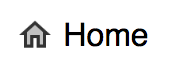

# Material Design Icons v2 (2018)

Google released it's new sexy set of icons [here](https://material.io/tools/icons),
but they haven't updated their Github repo with them.

There are 5 styles, and this includes all of them:

- Baseline (Filled)
- Outline (Outlined)
- Round (Rounded)
- Two-Tone
- Sharp

All of the svgs have been properly compressed through [svgo](https://github.com/svg/svgo).

---

Things you can do with this:

1. Use it as a cdn: [see below](#urls).
2. Download all of the Material Design icons and go to town with them
3. The svgs all have `fill="currentColor"` meaning that if you embed them
   into your HTML then it should match the containing element's text color,
   and can be overridden. (If you're using React, paste them into [svgr](https://svgr.now.sh/))

### Basic usage

```
<!-- Load stylesheet, which will use the relevant image assets -->
<link rel="stylesheet" href="https://cdn.rawgit.com/codesurgery/material-design-icons-v2/a74a5fb7/twotone/css/twotone.svg.min.css">

<!-- Profit -->
<div class="material-home"></div> Home
```

> ;

(Explanation)  
Just add the class `material-X` to a div or span.  
X can be any of the icon names found on [this page](https://material.io/tools/icons).

Warning: I'm not 100% sure that Google has made every icon for every style available 🤷‍♀

### URLs

**SVGs**

Style | URL
:---:|:---:
Baseline | https://cdn.rawgit.com/codesurgery/material-design-icons-v2/a74a5fb7/baseline/css/baseline.svg.min.css
Outline | https://cdn.rawgit.com/codesurgery/material-design-icons-v2/a74a5fb7/outline/css/outline.svg.min.css
Round | https://cdn.rawgit.com/codesurgery/material-design-icons-v2/a74a5fb7/round/css/round.svg.min.css
Two-Tone | https://cdn.rawgit.com/codesurgery/material-design-icons-v2/a74a5fb7/twotone/css/twotone.svg.min.css
Sharp | https://cdn.rawgit.com/codesurgery/material-design-icons-v2/a74a5fb7/sharp/css/sharp.svg.min.css

**PNGs**

Style | URL
:---:|:---:
Baseline | https://cdn.rawgit.com/codesurgery/material-design-icons-v2/a74a5fb7/baseline/css/baseline.png.min.css
Outline | https://cdn.rawgit.com/codesurgery/material-design-icons-v2/a74a5fb7/outline/css/outline.png.min.css
Round | https://cdn.rawgit.com/codesurgery/material-design-icons-v2/a74a5fb7/round/css/round.png.min.css
Two-Tone | https://cdn.rawgit.com/codesurgery/material-design-icons-v2/a74a5fb7/twotone/css/twotone.png.min.css
Sharp | https://cdn.rawgit.com/codesurgery/material-design-icons-v2/a74a5fb7/sharp/css/sharp.png.min.css

If you find the project useful show your support by giving the repo a star 💙

[](https://creativecommons.org/publicdomain/zero/1.0/)
